# 도면 설계서 (Drawing Specification) — FIG. 1 ~ FIG. 10

> 특허청 제출 도면은 흑백 선화(line drawing)여야 하며 음영·컬러·사진은 원칙적으로 불가하다.
> 아래 각 도면은 **작도 지시서**로서, 제도자(draftsperson)가 그대로 옮겨 그릴 수 있도록
> 블록·부호·연결선·라벨을 모두 특정하였다. mermaid 블록은 구조 확인용 시안이다.

---

## FIG. 1 — 시스템 전체 블록도 (대표도)

```mermaid
flowchart LR
  DC[["114<br/>DC port"]] --> PS
  subgraph PS["110  Power conversion stage"]
    SW["112  switching devices<br/>(6x SiC MOSFET)"]
  end
  PS --> AC[["116<br/>AC port"]]

  PS -. sense .-> SA
  subgraph SA["120  Sensor array"]
    S1["122 phase current"]
    S2["124 DC-link voltage"]
    S3["126 thermistor"]
    S4["128 on-state voltage<br/>sampling circuit"]
  end

  SA --> OBS["140  Electro-thermal<br/>state observer"]
  OBS -->|"T&#770;j (per device)"| ACC["150  Degradation<br/>accumulator"]
  OBS -->|"&Delta;R (slow state)"| AI
  ACC -->|"D, &mu;"| AI

  subgraph AI["160  AI processing unit  (2nd update rate)"]
    P1["162 thermal trajectory predictor"]
    P2["164 modulation optimiser"]
    P3["166 incipient-fault detector"]
  end

  AI -->|"u* candidate"| SUP
  subgraph SUP["170  Deterministic safety supervisor"]
    G1["172 admissible-set generator"]
    G2["174 projection"]
    G3["176 fallback controller"]
  end

  SUP -->|"u_applied"| MOD["130  Modulator<br/>(1st update rate,<br/>deterministic inner loop)"]
  MOD --> GD["132 gate drivers"] --> SW
  SA --> MOD
  SUP --- COM["180 communication interface"]
  AI --- COM
```

**작도 지시**
- 굵은 실선 = 전력 경로(114→110→116). 가는 실선 = 신호 경로. 파선 = 진단/보고 경로.
- **170을 160과 130 사이에 물리적으로 개재**시켜 그릴 것. 160에서 130으로 향하는 직결선을 그리지 말 것
  (청구항 1의 "interposed between" 및 청구항 12의 MPU 차단을 뒷받침하는 핵심 도시).
- 160 블록 테두리는 파선, 170·130·140 블록 테두리는 실선으로 하여 "비안전/안전" 배분을 시각화.

---

## FIG. 2 — 시간축 및 권한 분리도

**작도 지시** — 좌→우 시간축 위에 3개 레인을 그린다.
- 레인 1 `130 inner loop (1st rate, e.g. 10 kHz)`: 등간격 짧은 틱 다수. 각 틱 위 라벨 `PWM update`.
- 레인 2 `140 observer (3rd rate, 1–20 kHz)`: 레인 1보다 성긴 틱.
- 레인 3 `160 advisory loop (2nd rate, 10–200 Hz)`: 매우 성긴 틱. 각 틱에서 `170`으로 향하는 화살표.
- 레인 3의 한 틱을 ✗로 표시하고 `stall / mis-inference` 라벨. 그 지점에서 레인 1은 **중단 없이 계속됨**을
  화살표로 표시하고, `170: retain last projected set → after t_wd2 latch u_fb` 주석을 붙인다.
- 우측에 권한 표: `AI 160 → write only to 170 input register` / `170 → sole writer of 130`.

---

## FIG. 3 — 전기-열 상태관측기 (TSEP 보정)

```mermaid
flowchart TB
  IN1["i_d(k) phase current"] --> LOSS
  IN2["v_dc(k)"] --> LOSS
  IN3["u(k): f_sw, t_d"] --> LOSS
  LOSS["Loss model<br/>P_cond = i&sup2;&middot;R_ds,on(T&#770;j,i)<br/>P_sw = f_sw&middot;(E_on+E_off+E_rr)"] --> FOS
  T_REF["126 T_ref (thermistor)"] --> FOS
  FOS["Foster network, n = 4<br/>x_i(k)=x_i(k-1)e^(-&Delta;t/&tau;_i)+R_i&middot;P(k)(1-e^(-&Delta;t/&tau;_i))"] --> PRED["T&#770;j(k) predicted"]
  V_ON["128 v_on(k), i_on(k)"] --> NORM["normalise<br/>&rho;(k)=v_on/i_on"]
  PRED --> EXP["expected<br/>&rho;&#770;(k)=R_ds,on(T&#770;j,i_on)"]
  NORM --> SUB(("&Sigma;"))
  EXP --> SUB
  SUB -->|"innovation"| EKF["Extended Kalman filter<br/>state = [x_1..x_n , &Delta;R]"]
  EKF --> OUT1["T&#770;j&#8314;(k) → 150"]
  EKF --> OUT2["&Delta;R (slow) → 166"]
  GATE["validity gate:<br/>discard if i_on &lt; I_min<br/>or within blanking"] --> NORM
```

**작도 지시** — `ΣR` 합산점을 명확한 원(⊖)으로. EKF 블록에서 **두 개의 출력 화살표**(빠른 T̂j⁺, 느린 ΔR)를
서로 다른 선종으로 구분할 것. 이것이 청구항 2의 근거 도시이다.

---

## FIG. 4 — 레인플로우 계수 및 소모수명지수 누적

**작도 지시** — 2단 구성.
- **상단**: 가로축 시간, 세로축 T̂j⁺(°C)인 파형. 기본파 리플이 중첩된 완만한 상승 곡선.
  추출된 폐쇄 사이클 3개를 각각 양방향 화살표로 표시하고 `ΔTj1, ΔTj2, ΔTj3`, 평균선 `Tjm`, 폭 `t_on` 라벨.
- **중단**: 블록 `rainflow counting (3-point)` → 표 형태로 `(ΔTj, Tjm, t_on)` 3행.
- **하단**: 블록 `N_f = A·ΔTj^(−α)·exp(Ea/kB·Tjm)·t_on^(−β)·f_bw` → `D ← D + Σ 1/N_f` →
  비휘발성 메모리 심볼(NVM) → `μ = D / D_budget(t)` → 출력 화살표 `to 164`.
- 하단 우측에 작은 막대그래프: 소자 6개(S1~S6)별 D 값이 서로 다름을 도시(소자별 누적임을 명시).

---

## FIG. 5 — 허용집합 투영 및 폴백 래치

**작도 지시** — 2차원 파라미터 평면 (가로축 f_sw, 세로축 t_d)을 그린다.
- 사각형 영역 `U_adm` (실선). 그 경계에 각각 라벨: 좌변 `f_sw,min (ripple)`, 우변 `f_sw,max (EMC/driver)`,
  하변 `t_d,min (shoot-through, f(v_dc))`, 상변 `t_d,max (distortion)`.
- U_adm 내부에 곡선 경계 하나 추가: `Tj ≤ Tj,max` 반공간(빗금 바깥).
- 점 `u*` 를 U_adm 바깥에 찍고, 최근접점 `u_applied` 를 경계 위에 찍어 화살표로 연결, 라벨 `projection ‖·‖_W`.
- 이전 적용점 `u_prev` 주위에 작은 점선 사각형 `rate limit` 을 그려 청구항 1(i)의 최대 변화율 제약을 도시.
- 우측에 상태기계: `NORMAL --(u* ∉ U_adm, N_v 회 연속)--> LATCHED(u_fb)`,
  `LATCHED --(key cycle / explicit reset)--> NORMAL`, 추가 전이 `no candidate within t_wd → hold`,
  `no candidate within t_wd2 → LATCHED`.

---

## FIG. 6 — 복합비용과 최적 스위칭 주파수의 이동

**작도 지시** — 가로축 `f_sw`, 세로축 `cost`.
- 곡선 A: `C_loss` — f_sw에 대해 단조 증가(스위칭 손실 지배).
- 곡선 B: `C_life` — f_sw가 낮을수록 급증(저주파에서 ΔTj 스윙 증대), 우측으로 완만히 감소.
- 곡선 C1: `J = C_loss + λ_low·C_life` — 최소점 `f_sw*(λ_low)` 을 좌측에 표시.
- 곡선 C2: `J = C_loss + λ_high·C_life` — 최소점 `f_sw*(λ_high)` 을 우측에 표시.
- 두 최소점 사이에 굵은 화살표와 라벨 `shift when μ = D/D_budget > 1`.
- 좌하단 주석: `λ(μ) = λ0·exp(k(μ−1)) clipped to [λmin, λmax]`.
- 우상단 삽입 소도(inset): 같은 두 조건에서의 T̂j 파형 2개를 겹쳐 그려 `ΔTj: 64 K → 38 K`,
  `efficiency: −0.42 %p` 를 라벨. (효과 단락 [0026]/[0026-KO]의 근거 도시)

---

## FIG. 7 — 동작점 정규화 잔차 기반 초기고장 검출

**작도 지시** — 3단 구성.
- **상단**: 산점도. 가로축 `i_on`, 세로축 `v_on`. 신품 곡선군(온도별 3본)과 열화품 산점을 함께 표시하여
  "생(raw) 값으로는 구분 불가"임을 도시. 주석 `raw v_on: degradation masked by I, Tj dependence`.
- **중단**: 정규화·정합 블록. `ρ = v_on/i_on` → 비교기 → `ρ̂ = R_ds,on(T̂j, i_on)` →
  잔차 `e = ρ − ρ̂`. 옆에 `matched operating point` 강조 박스.
- **하단**: 동작점 빈 격자(가로 i_on 5구간 × 세로 T̂j 4구간). 각 셀에 표본수 n. n < n_min 셀은 회색 X 표시
  (`excluded — insufficient samples`). 유효 셀의 RLS 추정 `ΔR/R_nom` 을 시간축 그래프로 우측에 배치,
  `threshold 1 = 5 %` (→ incipient signal), `threshold 2 = 20 %` (→ derating request, λ↑) 수평 파선 2본.

---

## FIG. 8 — 제어 방법 순서도

```mermaid
flowchart TB
  ST([START]) --> A["S110 inner-loop tick:<br/>sample i, v_dc, v_on;<br/>generate gate signals from u_applied"]
  A --> B{"S120 observer tick?"}
  B -- no --> A
  B -- yes --> C["S130 compute P_cond + P_sw"]
  C --> D["S140 propagate through Foster network → T&#770;j"]
  D --> E{"i_on &ge; I_min<br/>and outside blanking?"}
  E -- no --> G
  E -- yes --> F["S150 &rho;=v_on/i_on ; EKF correct → T&#770;j&#8314; ; update &Delta;R"]
  F --> G{"S160 accumulator tick?"}
  G -- no --> A
  G -- yes --> H["S170 rainflow → (&Delta;Tj, Tjm, t_on)"]
  H --> I["S180 N_f ← lifetime model ; D ← D + 1/N_f ; &mu; ← D/D_budget"]
  I --> J{"S190 advisory tick?"}
  J -- no --> A
  J -- yes --> K["S200 predict Tj trajectory per candidate u over horizon H"]
  K --> L["S210 J(u)=c_e&middot;E_loss + &lambda;(&mu;)&middot;c_l&middot;&Delta;D + c_q&middot;Q ; u* = argmin J"]
  L --> M["S220 172: build U_adm from Tj,max, t_d,min(v_dc), rate limit"]
  M --> N{"S230 u* &isin; U_adm ?"}
  N -- yes --> O["S240 counter ← 0 ; u_applied ← u*"]
  N -- no --> P["S250 counter++ ; u_applied ← proj(u*, U_adm)"]
  P --> Q{"S260 counter &gt; N_v ?"}
  Q -- yes --> R["S270 LATCH u_applied ← u_fb ; set DTC ; report via 180"]
  Q -- no --> A
  O --> A
  R --> A
```

---

## FIG. 9 — 연합학습 구성

**작도 지시**
- 중앙에 `190 aggregation server`, 그 안에 블록 `weighted FedAvg  w_k ∝ f(n_k, diversity_k)`.
- 방사상으로 3~4개의 `100-1 … 100-n inverter control system` (각각 차량 아이콘 또는 ESS 컨테이너 아이콘).
- 각 시스템 → 서버 방향 화살표 라벨 **`model update Δθ only (no raw telemetry)`** — 굵게.
- 서버 → 각 시스템 화살표 라벨 `aggregated θ_g`.
- 각 시스템 내부에 작은 블록 `local personalisation of subset θ_p` 와,
  그 뒤에 반드시 `170 verification against recorded validation scenarios` 게이트를 직렬로 배치
  (청구항 16의 "admitted into service only after verification" 근거 도시).
- 서버 내부에 점선 박스 `distributed identification of A, α, β, E_a from field returns`.

---

## FIG. 10 — EV·ESS 공유 구조

**작도 지시** — 좌우 2열 대칭 구성.
- 좌열: `200 EV traction inverter` ← 공통 스택(`140 / 150 / 170` 실선 박스) ← `162` 입력
  `route profile, driver model`.
- 우열: `210 ESS power conversion system` ← 동일한 공통 스택 ← `162` 입력 `dispatch schedule, price forecast`.
- 두 열 사이 중앙에 `domain adaptation layer` 블록. 좌우 양방향 화살표, 라벨
  `rescale A, α, β, Ea by thermal-cycle-period distribution`.
  좌측 주석 `traction: short cycles, large ΔTj`, 우측 주석 `storage: long cycles, small ΔTj`.
- 좌열 하단에 `V2G mode` 분기: `D (traction) → grid dispatch decision → compensation ∝ ΔD` (청구항 18 근거).

---

## 제도 체크리스트

- [ ] 모든 도면 흑백 선화, 음영 없음, 최소 선폭 0.3 mm 이상
- [ ] 부호는 명세서 【부호의 설명】과 완전 일치 (100~210)
- [ ] 도면 내 문자는 영문 명세서용/국문 명세서용 2벌 준비 (KIPO 제출본은 국문 표기 권장)
- [ ] FIG. 1을 대표도로 지정
- [ ] FIG. 1에서 160 → 130 직결선이 없는지 최종 확인 (**청구항 1 필수 도시사항**)
- [ ] FIG. 3에서 EKF의 빠른 출력/느린 출력이 구분되어 있는지 확인 (**청구항 2 근거**)
- [ ] FIG. 5의 상태기계에 래치 해제 조건(key cycle / explicit reset)이 표기되어 있는지 확인
- [ ] mermaid 시안은 제출물이 아님 — 반드시 CAD/Visio 선화로 재작도할 것
