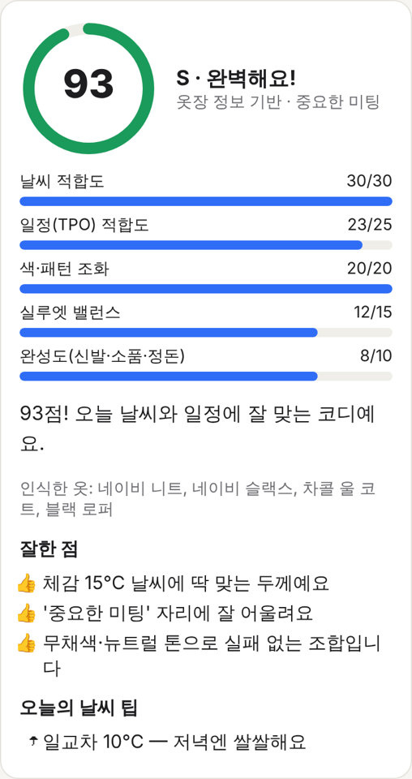
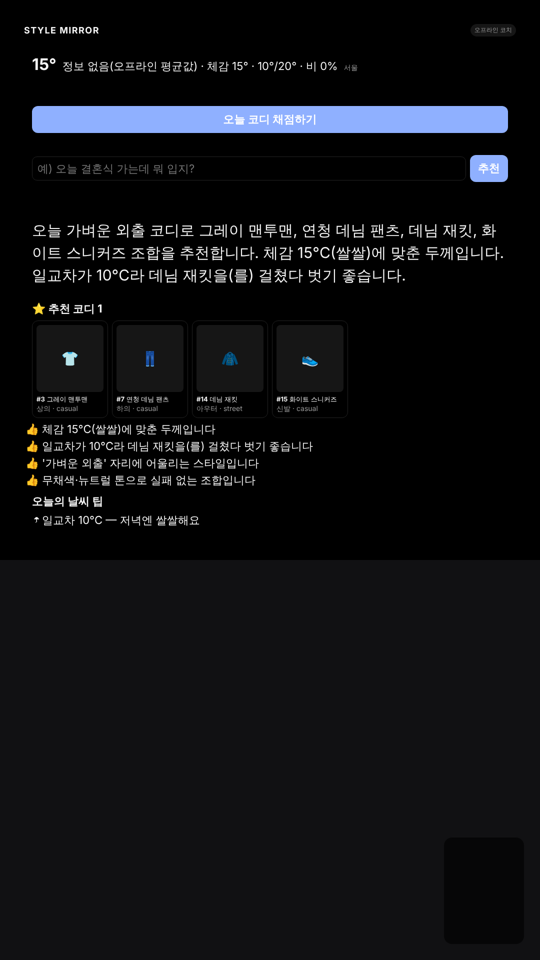
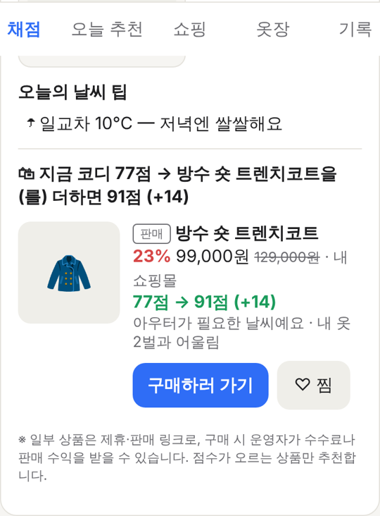

# STYLE MIRROR — AI 외출 코디 코치 (휴대폰 앱 + 스마트 거울)

외출 전에 **휴대폰 셀카**나 **거울 카메라**로 찍으면 AI가 오늘 옷차림을
**100점 만점으로 채점**하고, 오늘 날씨와 일정에 맞게 무엇을 바꿀지 코칭해 줍니다.

```
[셀카 / 거울 카메라] → [옷 인식] → [날씨·일정·내 옷장과 비교] → [점수 + 코칭 + 내 옷장에서 추천]
```

<p>
  
  
</p>

| 화면 | 주소 | 용도 |
|---|---|---|
| 휴대폰 앱 | `http://<PC IP>:8080/` | 셀카 채점, 오늘 코디 추천, 옷장 등록, 점수 기록 |
| 거울 화면 | `http://localhost:8080/?mode=mirror` | 하프미러 뒤 모니터용 (검은 배경 + 큰 글씨) |

- **API 키가 없어도 동작합니다.** 옷장에서 오늘 입은 옷을 고르면 규칙 엔진이 채점합니다.
- `ANTHROPIC_API_KEY`를 설정하면 **사진만 찍어도** Claude가 옷을 인식해서 채점합니다.
- 카메라 사진은 **채점에만 쓰고 저장하지 않습니다.** 저장되는 것은 점수와 옷장에 직접 등록한 옷 사진뿐입니다.

---

## 1. 채점 기준 (100점)

| 항목 | 배점 | 보는 것 |
|---|---|---|
| 날씨 적합도 | 30 | 체감 기온 대비 두께, 아우터 필요 여부, 비·눈 대비 |
| 일정(TPO) 적합도 | 25 | 출근·미팅·결혼식·데이트·등교·운동 등 자리에 맞는지 |
| 색·패턴 조화 | 20 | 포인트 컬러는 1개, 패턴은 1개까지가 무난함 |
| 실루엣 밸런스 | 15 | 상·하의 길이/핏 비율 (사진 모드에서 정확함) |
| 완성도 | 10 | 신발·소품·정돈 상태 |

등급: **S** 90점 이상 · **A** 80점 이상 · **B** 65점 이상 · **C** 50점 이상 · **D** 50점 미만

> 얼굴·체형·나이는 **채점하지 않습니다.** 옷의 조합과 상황 적합성만 봅니다.
> 가족 모두(아이 포함)가 쓰는 앱이기 때문에 정한 원칙이고, AI 프롬프트에도 명시돼 있습니다.

---

## 2. 설치와 실행 (처음 하는 분 기준)

### ① 준비물
- 파이썬 3.9 이상 (`python3 --version`으로 확인)
- (선택) Claude API 키: https://console.anthropic.com 에서 발급

### ② 설치
```bash
cd Yes                      # 이 저장소 폴더
pip install anthropic       # AI 사진 채점을 쓸 때만 필요
```
그 밖의 기능은 파이썬 기본 라이브러리만 쓰기 때문에 추가로 설치할 것이 없습니다.

### ③ 옷장 만들기 (예시 옷 17벌 포함)
```bash
python3 -m stylemirror init --sample
```

### ④ 서버 실행
```bash
# (선택) AI 켜기
export ANTHROPIC_API_KEY="sk-ant-..."      # 윈도우: set ANTHROPIC_API_KEY=sk-ant-...

python3 -m stylemirror serve --lan
```
출력된 주소(`http://192.168.x.x:8080/`)를 **같은 와이파이에 연결된 휴대폰**으로 열면 됩니다.

### ⑤ 휴대폰에서 쓰는 방법
1. 위쪽에서 **사용자**(가족 이름)와 **일정**(출근, 결혼식 …)을 고릅니다.
2. **채점** 탭에서 `오늘 코디 채점하기` → 휴대폰을 세워 두고 3초 타이머로 전신 촬영
   - `http://IP` 주소에서는 브라우저 보안 정책 때문에 실시간 카메라 대신 **휴대폰 기본 카메라**가 열립니다.
     정상 동작이며, 찍은 사진이 그대로 채점됩니다.
3. AI 없이 쓸 때는 **사진 없이 채점** 칸에서 입은 옷을 골라 `고른 옷으로 채점`을 누릅니다.
4. **오늘 추천** 탭: "오늘 결혼식 가는데 뭐 입지?"처럼 입력하면 내 옷장에서 코디 3개를 골라 줍니다.
   `이걸로 입을게요`를 누르면 착용 기록이 남아서 다음 날은 다른 옷을 추천합니다.
5. **옷장** 탭: 옷 사진을 찍으면 AI가 이름·종류·색·두께를 자동으로 채워 줍니다.
6. **기록** 탭: 최근 점수 그래프

### ⑥ 명령어로 쓰기 (테스트용)
```bash
python3 -m stylemirror list                         # 옷장 목록
python3 -m stylemirror recommend --request "내일 면접이야"
python3 -m stylemirror score 2 6 13 16 --occasion meeting   # 옷 번호로 채점
python3 -m stylemirror score --photo me.jpg         # 사진으로 채점 (AI)
python3 -m stylemirror check                        # 환경 점검
```

---

## 3. 스마트 거울로 만들기 (하드웨어)

| 부품 | 추천 | 비고 |
|---|---|---|
| 디스플레이 | 24~32인치 모니터, 세로로 거치 | 밝기가 높을수록 글자가 잘 보임 |
| 거울 | 하프미러(원웨이 미러) 아크릴/유리, 투과율 20~30% | 모니터 앞에 부착 |
| 컴퓨터 | 라즈베리 파이 5 (8GB) 또는 미니 PC | 이 서버를 실행 |
| 카메라 | FHD USB 웹캠, 거울 상단 중앙 | **물리 셔터/커버 달린 제품 권장** |

거울용 PC에서:
```bash
python3 -m stylemirror serve --lan &
chromium-browser --kiosk "http://localhost:8080/?mode=mirror"
```
- 거울 화면은 **검은 배경**이라 하프미러를 통해 보면 거울로 보이고, 글자만 떠 보입니다.
- `localhost` 주소에서는 실시간 카메라가 바로 켜집니다. 30분마다 추천을 새로 고칩니다.
- 거울 화면을 눌러 채점할 수 있게 하려면 터치 프레임이나 무선 버튼(키보드 Enter)을 연결하세요.

---

## 4. 폴더 구조

```
stylemirror/
├── __main__.py        python3 -m stylemirror 진입점
├── cli.py             명령어 (init / serve / score / recommend / list / add / check)
├── config.py          설정 (도시 좌표, 포트, AI 모델) ← mirror.config.json 으로 덮어쓰기
├── closet.py          내 옷장 SQLite DB (옷, 착용 기록, 점수 기록)
├── weather.py         Open-Meteo 날씨·미세먼지 (무료, 키 불필요, 오프라인 대체값)
├── stylist.py         규칙 기반 추천·100점 채점 엔진 (AI 없이 동작)
├── coach.py           Claude Vision 채점·옷 자동 태깅·추천 설명 (실패하면 규칙 엔진으로 폴백)
├── commerce.py        상품 카탈로그·가상 착용 재채점·클릭/찜 기록·어린이 차단
├── catalog.sample.csv 예시 상품 20개 (가상 상품, example.com 주소)
├── server.py          로컬 웹서버 + JSON API (/go/상품ID 구매 링크 포함)
└── web/app.html       휴대폰 앱 + 거울 화면 (한 파일)
tests/test_stylemirror.py
```

설정을 바꾸려면 `stylemirror/mirror.config.example.json`을 저장소 루트에 `mirror.config.json`으로 복사해서
도시와 위도·경도를 수정하세요. (예: 부산 35.1796, 129.0756)

### AI 비용과 속도
- 기본 모델은 `claude-opus-5-5`, effort는 `low`(거울은 빨리 답해야 하므로)입니다.
- 사진은 브라우저에서 긴 변 1024px JPEG로 줄여 보내기 때문에 전송량이 작습니다.
- 추천은 규칙 엔진이 먼저 후보 3개를 고르고, Claude는 그중 하나를 골라 설명만 합니다.
  그래서 **옷장에 없는 옷을 지어내는 일이 없고** 토큰도 적게 씁니다.
- 안전 분류기가 요청을 거절하면 서버에서 권장 모델로 자동 재시도합니다(`fallbacks: "default"`).
- 비용을 더 줄이려면 `mirror.config.json`의 `llm_model`을 `claude-sonnet-5-5`로 바꾸세요.

---

## 5. 개인정보·안전 (가정용 필수)

- **카메라 사진은 메모리에서만 처리하고 디스크에 저장하지 않습니다.** 서버 로그에도 남기지 않습니다.
- AI 모드에서는 사진이 채점을 위해 Anthropic API로 전송됩니다. 가족에게 이 점을 알려 주세요.
- 아이가 사용할 때: 점수 경쟁보다 "날씨에 맞게 입기" 습관 형성에 맞춰져 있고,
  외모·체형 평가를 하지 않도록 프롬프트로 막아 두었습니다.
- 서버는 기본으로 `127.0.0.1`(이 기기 안에서만 접속)에서 실행됩니다.
  `--lan`은 집 와이파이 안에서만 쓰고, 공유기 포트포워딩으로 외부에 공개하지 마세요(로그인 기능이 없습니다).
- 판매용 제품으로 만들 때는 개인정보 처리방침, 만 14세 미만 법정대리인 동의 절차가 필요합니다.

---

## 6. 커머스 연동 — "점수를 올려 주는 상품만" 추천



```
채점 → 부족한 점 발견 → ① 내 옷장에 해결책이 있으면 옷장 옷 안내 (판매 안 함)
                       → ② 없으면 상품을 '가상 착용'해서 재채점 → 점수가 오르는 상품만 노출
                       → [구매하러 가기] → /go/상품ID (클릭 기록 + UTM) → 내 쇼핑몰/제휴몰
```

| 상황 | 화면에 나오는 것 |
|---|---|
| 비 오는 날 셔츠+슬랙스, 옷장에 트렌치코트 **있음** | "새로 살 필요 없어요. 옷장의 베이지 트렌치코트를 입으면 +22점이에요." |
| 같은 상황, 옷장에 아우터 **없음** | "지금 코디 77점 → 방수 숏 트렌치코트를 더하면 91점 (+14)" + 구매 버튼 |
| 이미 잘 입음 (80점 이상) | 쇼핑 추천 없음 |
| 어린이 프로필 | 쇼핑 추천·찜 모두 차단 |

**왜 이렇게 만들었나:** 매번 물건을 권하는 거울은 금방 광고판이 되어 꺼집니다.
"살 필요 없어요"라고 말해 주는 경험이 쌓여야 정말 필요할 때 추천을 믿고 구매합니다.
기준은 `commerce.py`의 `min_gain`(기본 5점)입니다. 옷장 옷으로 바꾼 것보다 5점 이상 더 올라야 추천됩니다.

### 내 판매 상품 넣기 (CSV)
엑셀에서 `stylemirror/catalog.sample.csv`와 같은 열로 정리한 뒤 **CSV UTF-8**로 저장하고:
```bash
python3 -m stylemirror catalog 내상품.csv      # 같은 id 는 덮어쓰기 (가격·재고 갱신)
python3 -m stylemirror shop 1 6 --occasion office   # 이 코디에 필요한 상품 미리보기
python3 -m stylemirror stats                   # 상품별 노출·클릭·찜·클릭률(CTR)
```

| 열 | 설명 |
|---|---|
| `id` | 상품 코드 (스마트스토어 상품번호 등) |
| `category` | top / bottom / dress / outer / shoes / accessory |
| `style` | casual / formal / business / sporty / street / lovely / minimal |
| `warmth` | 1(아주 얇음) ~ 5(패딩) — **채점에 직접 쓰이므로 정확히** |
| `waterproof` | 1 = 방수 |
| `price`, `sale_price` | 정가, 할인가 (할인율 자동 표시) |
| `url` | 상품 페이지 (쿠팡 파트너스·제휴 코드가 붙은 주소 그대로) |
| `sponsored` | 1 = 제휴 링크(화면에 **광고**), 0 = 내 쇼핑몰 직접 판매(화면에 **판매**) |
| `in_stock` | 0 이면 추천하지 않음 |

- 구매 버튼은 `/go/상품ID`를 거쳐 클릭을 기록하고 `utm_source=stylemirror&utm_campaign=score|today|mirror|shop`을
  붙여 이동합니다. 스마트스토어·우커머스·GA4에서 **어느 화면에서 온 구매인지** 볼 수 있습니다.
- 등록된 상품 주소로만 이동하므로 링크를 조작해 다른 사이트로 보낼 수 없습니다.
- 거울 화면에서는 1순위 상품 하나와 **QR 코드**를 보여 줍니다. 휴대폰으로 찍으면 상품 페이지가 열립니다
  (`serve --lan`으로 실행하면 QR이 휴대폰에서 열 수 있는 주소로 만들어집니다).
- **쇼핑** 탭에는 오늘 필요한 아이템과 찜 목록이 있고, 어린이 프로필 스위치가 있습니다.

### 법·신뢰 체크리스트 (판매 시작 전)
- [x] 제휴 링크에 **광고** 표시 + 하단 수수료 고지 (공정위 추천·보증 심사지침의 "경제적 이해관계 표시")
- [x] 어린이에게 구매 유도 안 함 (어린이 프로필 차단)
- [x] 카메라 사진 미저장, 클릭 기록에는 가족 이름만 남고 사진·위치는 남기지 않음
- [ ] 쿠팡 파트너스 등 제휴 프로그램은 각자 정한 **고지 문구**가 따로 있습니다. 약관 문구로 `AD_NOTICE`를 바꾸세요.
- [ ] 직접 판매(위탁판매·구매대행)는 통신판매업 신고, 사업자 정보 표시가 필요합니다.
- [ ] 외부에 서비스로 공개할 때는 개인정보 처리방침에 "구매 링크 클릭 기록"을 넣으세요.

### 매출이 나는 순서 (추천)
1. **내 쇼핑몰 상품(판매)**: 마진이 가장 큽니다. 채점에서 자주 나오는 부족 아이템(방수 아우터, 경량 패딩 등)부터 소싱하세요.
   `stats`의 평균 상승 점수가 높고 클릭률이 높은 상품이 다음 소싱 후보입니다.
2. **제휴 링크(광고)**: 내 상품이 없는 카테고리를 메웁니다(예: 신발, 정장).
3. **찜 → 알림**: 찜한 상품의 할인 시작이나 "다음 주 비 소식" 때 알려 주기 (다음 단계)

## 7. 사업화 메모

**IP 보호 순서 (출시 전)**
1. **상표**: "STYLE MIRROR"는 설명적인 이름이라 **등록이 어렵고**, 비슷한 이름의 제품도 이미 많습니다.
   출시 전에 독창적인 브랜드명을 정하고 KIPRIS에서 9류(소프트웨어·스마트 거울)와 35류, 42류를 검색한 뒤 출원하세요.
2. **저작권**: 소스코드, UI, 코칭 문구는 만드는 순간 자동으로 보호됩니다. 커밋 기록이 창작 시점의 증거가 됩니다.
3. **특허 (가능성 검토만)**: "AI가 옷을 평가한다"는 아이디어 자체는 특허를 받기 어렵습니다.
   검토할 만한 것은 구체적인 기술 구성입니다. 예) *규칙 엔진이 날씨·착용 이력으로 후보를 제한하고,
   비전 모델은 그 후보 안에서만 선택하게 해서 존재하지 않는 옷 추천을 막는 방법*,
   *가족 구성원별 점수 이력을 이용한 채점 보정*. 변리사 선행기술 조사가 먼저입니다.
4. **디자인권**: 거울 프레임이나 하드웨어 외형을 만들면 그때 출원을 검토하세요.

**수익 모델 우선순위 (추천)**
1. 무료 앱(규칙 채점) → **프리미엄 구독**(AI 사진 채점, 가족 계정, 점수 리포트)
2. 옷장에 부족한 아이템만 점수 근거와 함께 추천 → 내 쇼핑몰/제휴몰 연동 (6장, 구현 완료)
3. **스마트 거울 하드웨어 키트** 판매 또는 DIY 가이드
4. B2B: 의류 매장 피팅룸 키오스크, 학교 교복·체육복 날씨 안내

---

## 8. 다음 단계 (로드맵)

- [ ] 실제 가족 3~5명이 2주 동안 써 보고 점수와 체감이 맞는지 확인 (플레이 테스트)
- [ ] 사용자별 선호(추위 많이 탐, 선호 색)를 저장해서 채점 개인화
- [ ] 음성 명령("오늘 뭐 입지?") — 브라우저 음성 인식 또는 Whisper 연동
- [ ] 캘린더 연동으로 일정 자동 선택
- [ ] 찜 상품 할인·날씨 알림, 스마트스토어 상품 API 자동 동기화
- [ ] 구매 완료(전환) 추적: 쇼핑몰 주문 웹훅 ↔ 클릭 기록 연결
- [ ] PWA(홈 화면 설치) 및 HTTPS 지원 → 휴대폰에서 실시간 카메라 사용
